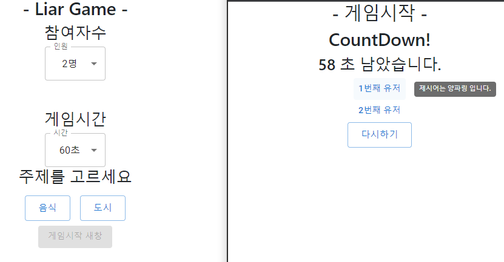

# # 리액트로 만들어본 라이어게임

구현한 첫번째, 그리고 두번째 화면은 다음과 같다.

1.라우터를 사용해 다른 페이지로 자료를 props로 전달해 만든방식

2.한페이지내에서 modal로 동작하는방식

2가지를 만들었다.

영상채팅방에서 부가기능으로 쓰려고 로직만 짜려고 만들다가 설명을위해 아예 만들어버리는게

편할거 같아서 만들었는데 추후 어디 이식해서 사용하기 좋을거같다.

물론 급하게 대충만들어서 useState도 막 짜놓긴했지만 필요할때 가져다 사용하면 좋을거같다.

\- 배열랜덤셔플

\- 타이머함수

두가지를 다른곳에서 가져와서 사용했기에 그역시도 나중에 참고하면 좋을듯한 로직이다!
